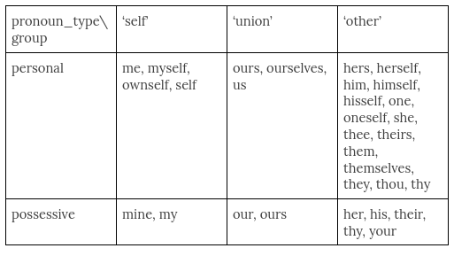
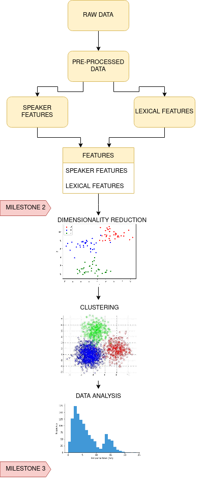

# Tell me a few words and I will tell you who you are

## Abstract

Have you ever read an article or a book and wondered what the writer is like? With the emergence of big data, relationships between the structure of a text and the writer/speaker's attributes can be extracted.

Given the large number of quotations available and their associated speaker, one could explore the correlation between lexical features in speech and the speaker's attributes. Such an analysis would allow us to understand if there is any relationship between the socio-cultural status of an individual and the structure of his speech. The analysis can also be performed temporarily from 2015 to 2020 and reveal information concerning the evolution of particular trends over time. The analysis would allow us to cluster speakers that share similarities in both "lexical features" and "speaker attributes" and extract patterns. This could potentially help people estimate the attributes of a writer/speaker such as his/her ethnicity, educational background, gender, and age.

## Research questions
* How does your socio-cultural background, such as nationality, gender, or religion, affect the way you speak? 
* If so, can an algorithm predict who you are given a set of words you uttered?

## Datasets
* Quotebank data with unique quotes 2015-2020
* Wikidata data with speaker information
* Wikidata QID labels

### Data management
We use Google Collab to load and preprocess the raw Quotebank data because the dataset is very large. 
We access each line of the bz2 and parquet files using the methods provided in the examples.
Large compressed files (such as processed Quotebank data) are stored in the Google Drive. The .parquet files are also stored there for easy access.

## Methods
### Preprocessing
#### Quotebank data 
`preprocessing_notebook.ipynb`

The raw Quotebank data is preprocessed in Google Collab by parsing through each line of the JSON files.
Since we are interested in the way people speak, we do the following:
 * Remove the following columns `['urls','phase','date','numOccurences']`
 * Remove quotes with no speakers
 * Remove quotes with multiple associated QIDs
    * Multiple QIDs imply that there are two speakers with the same name. Since we cannot know which person spoke the quote without further investigation, we remove these rows.
 * Store the probability of the most likely speaker only

The resulting data is stored as a .bz2 file. The JSON file has the following keys:
`['quoteID','quotation','speaker','prob','qid']`

We checked that Quotebank identified a speaker for 65-66% of its quotes. After removing the quotes with non-unique speakers, we retain 46-48% of the original quotes, which totals to approximately 53.7 million quotations. 

#### Speaker data
`speaker_cleaning.ipynb`

We also need to extract the information of the speakers. We first read all the parquet files into a dataframe. To reduce the overall of the dataset we need to handle, we remove the speaker information columns that we are not interested in. Thus, we removed the columns `[‘aliases’, ‘lastrevid’, ‘US_congress_bio_ID’, ‘label’, ‘candidacy’, ‘type’]`. We can then merge the preprocessed quotebank data with the speaker data. Since there are around 9 million unique speakers, quotes with speakers that are not in the speakers Wikidata provided are removed in this process. We checked that the quotes removed are a small fraction of all the preprocessed quotes (< 1%).

### Feature extraction
`feature_generation.ipynb`, `feature_generation.py`

After all preprocessing, the relevant features can be extracted as follows:

Lexical Features: A processed dataframe called lexical would have the following keys:

`[‘quoteID’,  ‘self_pronouns’, ‘union_pronouns’, ‘other_pronouns’, ‘sentiment_rate’, ‘comparative_rate’, ‘verb_tense’]`

Each column is described below:
* QuoteID : The identification number of the quotation
* self_pronouns: The number of pronouns related to the self (See table below)
* Union_pronouns: The number of pronouns related to the union of the self and the other (See table below)
* Other_pronouns: The number of pronouns related to the other (See table below)
* Sentiment_rate : The sentiment attached to the quotation. Scalar value in the range [-1,1] where -1 is extremely negative and +1 is extremely positive
* Adjectives: Number of adjectives 
* Comparative_rate: Rate of regular adjectives in comparison to superlatives and comparatives. Scalar value in [-1,1] where -1 means only comparatives/superlatives, 1 only regular adjectives.

Speaker Features: Speaker features are extracted from Wikidata. The dataframe includes the following columns:

`[‘quoteID’,  ‘gender’, ‘nationality’, ‘religion’, ‘educational_level’, ‘birth_date’, 'occupation']`

### Statistical analysis
`feature_exploration.ipynb`, `utils.py`, `mappings.py`

We perform simple statistical anlysis on our data to understand it better. Boxplots are made to investigate the mean, median, and outliers of different lexical and speaker features. We also perform the Mann-Whitney U-test to assess the statistical significance of lexical versus speaker features.

### Pattern extraction
`feature_exploration.ipynb`, `utils.py`, `mappings.py`

Pattern extraction is done through feature selection, dimensionality reduction, and clustering. We use a tree-based feature selection method to reduce the number of lexical features used. Keeping the lexical features most relvant to the speaker features, we perform PCA and t-SNE to further reduce the dimension of our dataset. Projecting into a lower dimensional space would allow us to observe and extract patterns more easily. Patterns can then be extracted using unsupervised clustering techniques to generate groups of data points that share similar features. The analysis of these clusters would allow us to make conclusions concerning the correlation between a speaker and the lexical content used. The analysis would make use of all the different tools learned in the ADA course.

### Modelling
`feature_exploration.ipynb`, `utils.py`, `mappings.py`

We also tried to train a Gradient Boosting Regressor to predict individual speaker features using the lexical features. We tried this using features suggested by the tree-based feature selection and the features we found to be statistically significant.

The summary of the original pipeline is summarized in the schematic below:

## Proposed timeline & Project Organization
* Week 6
   * Discussing and selecting topic (all)
* Week 7
   * Raw data cleaning and preprocessing (CJ)
* Week 8
   * Speaker feature generation using Wikidata (RD)
   * Lexical feature generation using NLTK (KS, OH)
   * Exploratory data-analysis (all)
* **Milestone P2, due 23:59 CET, 12 Nov 2021**
* Week 9 & Week 10
   * HW2
* Week 11
   * Minor corrections of M2 (CJ)
   * Speaker data cleaning (KS, RD)
   * Add more features - see M2 feedback (OH)
   * Feature selection and data merging (CJ)
   * Dimensionality reduction with PCA, TSNE (CJ, OH)
* Week 12
   * Begin making website (OH)
   * Clustering (OH)
   * Model training (CJ)
   * Statistical analysis (KS, RD)
   * Begin data visualization (all)
* Week 13
   * Data analysis (RD, KS)
   * Cleaning of notebooks, ReadME, files (CJ)
   * Final data visualization (all)
   * Completion of data story (all)
   * Completion of website (OH)
* **Milestone P3, due 23:59 CET, 17 Dec 2021**

